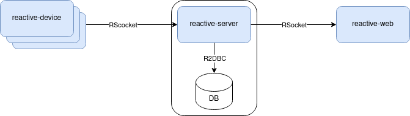
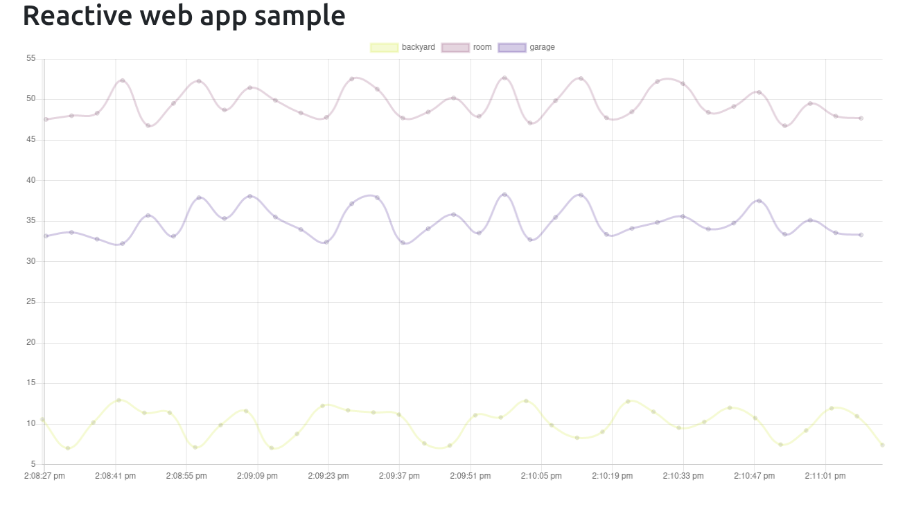

= Fully Reactive sample project

This is a sample project that uses fully reactive approach.
The project consists of 3 parts:

- `reactive-server` is a microservice that
* receives an inbound stream of emulated sensor data from IoT devices (see `reactive-device`)
* sends an outbound steam of the sensor data to other clients (see `reactive-web`)
- `reactive-device` is a mini-module that emulates an IoT device and sends data to the server
- `reactive-web` is a web app that consumes data from the server and displays it on UI

Frameworks/technologies used:

- Spring Boot
    * For the JVM backend. I'm using Kotlin in this project.
- Spring WebFlux with Netty and Project Reactor under the hood
    * Netty is a non-blocking network application framework
    * Project Reactor is a reactive library that conforms with Reactive Streams specification. Project Reactor is based on Netty.
- Persistence: Spring Data R2DBC via r2dbc H2 driver *
    * R2DBC is a modern non-blocking alternative to JDBC driver. It is based on Reactive Streams specification
- Protocol: RSocket over WebSockets
    * RSocket protocol provides Reactive Streams semantics, as well
    * RSocket works on byte stream transports such as TCP, WebSockets, or Aeron. I'm using WebSockets in this project.
- Kotlin's coroutines
    * Could've used Project Reactor's Flux/Mono, but since I'm using Kotlin, I decided to use Kotlin Flow.
- Gradle for building the backend
- React.js
    * just for UI components. Nothing to do with Reactive approach though :)
- rsocket-websocket JS client
- Typescript
- Chart.js
    * to draw the sensor data nicely
- Yarn for building the frontend
- Docker Compose
    * to run all parts together in one network

NOTE: - NoSQL DB is more suitable for sensor data, but I'd like to use R2DBC in this project +
- For simplicity’s sake, I'm using embedded H2 database. In real world it should be something standalone instead.

== Build

    ./gradlew build

== Run on a local machine (without Docker)

. Start the server:

    java -jar reactive-server/build/libs/reactive-server-VERSION.jar

- All jars are executable thanks to Spring Boot.
- By default, `reactive-server` will start Netty RSocket on port 7000.
- It also exposes Spring Actuator on port 8001.

. Then start several instances of `reactive-device` in different terminals:

    java -jar reactive-device/build/libs/reactive-device-VERSION.jar
+
It's safe to run several instances of `reactive-device` on one host, as they are not exposing any ports.

. Monitor Spring Actuator from another terminal. The value should increase over time:

    curl http://localhost:8001/actuator/metrics/sensor.inbound.count

. Start `reactive-web`:

    cd reactive-web
    yarn start

. Then open: http://localhost:3000

== Run in Docker with Docker Compose (easier way)

. Alternatively, run with Docker Compose:

    docker-compose build
    docker-compose up

- This will start 1 container with `reactive-server`
- Plus 3 containers with `reactive-device`
- Plus one container with `reactive-web`
- All 5 containers are in one Docker network
- Exposes Spring Actuator in `reactive-server` on port 8001, so it is accessible from the host.
- Exposes RSocket port in `reactive-server`, so it is accessible by JS from the browser.
- For details, see `docker-compose.yml`.

. Monitor Spring Actuator from another terminal. The value should increase over time:

    curl http://localhost:8001/actuator/metrics/sensor.inbound.count

. Then open: http://localhost:3000. Refresh the page if needed. If the `reactive-server` gets restarted, then you have to refresh the page manually.

== When running

`reactive-web` will show a chart like this, which is updated automatically when new sensor data is streamed in.
All data from `reactive-device` s is randomized around some random baseline (see `SensorDataSender`).
The web app displays data for the last 100 timestamps.

You should also see incoming messages in the browser console:

----
Connecting via RSocket to ws://localhost:7000/rsocket MessageService.ts:19:8
Received
Object { temperature: 12.2178, location: "backyard", instant: Date Sun Apr 04 2021 14:07:51 GMT-0500 (Central Daylight Time), id: null }
SensorDataComponent.tsx:54:20
Received
Object { temperature: 50.6455, location: "room", instant: Date Sun Apr 04 2021 14:07:52 GMT-0500 (Central Daylight Time), id: null }
SensorDataComponent.tsx:54:20
Received
Object { temperature: 34.711, location: "garage", instant: Date Sun Apr 04 2021 14:07:52 GMT-0500 (Central Daylight Time), id: null }
SensorDataComponent.tsx:54:20
----

the same data in the `reactive-server` logs when it's coming in from `reactive-devices`:

----
sensor-server_1  | 2021-04-04 19:07:51.305 DEBUG 1 --- [or-http-epoll-5] p.s.r.server.service.SensorDataService   : Received SensorData(temperature=12.2178, location=backyard, instant=2021-04-04T19:07:51.224Z, id=null)
sensor-server_1  | 2021-04-04 19:07:52.080 DEBUG 1 --- [or-http-epoll-6] p.s.r.server.service.SensorDataService   : Received SensorData(temperature=50.6455, location=room, instant=2021-04-04T19:07:52.052Z, id=null)
sensor-server_1  | 2021-04-04 19:07:52.093 DEBUG 1 --- [or-http-epoll-7] p.s.r.server.service.SensorDataService   : Received SensorData(temperature=34.711, location=garage, instant=2021-04-04T19:07:52.063Z, id=null)
----
